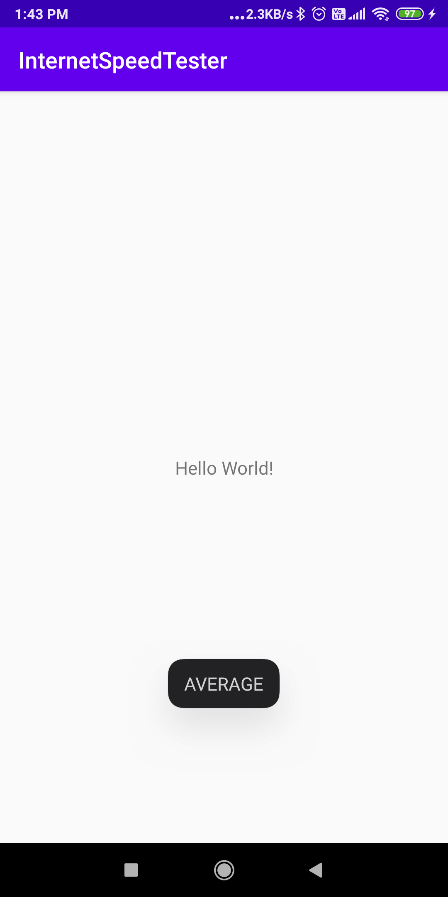

[](https://jitpack.io/#Mustaqode/InternetSpeedTester)
# InternetSpeedTester 


## Dependencies

Add the following dependencies in your project and root level gradle files

```

	allprojects {
		repositories {
			...
			maven { url 'https://jitpack.io' }
		}
	}
  
  ```
  
  ```
  
  	dependencies {
	        implementation 'com.github.Mustaqode:InternetSpeedTester:1.0'
	  }
    
  ```
  
  ## Other dependencies
  
  [Square](https://square.github.io/okhttp/#releases) - okHttp libary to make network call. 
  
  [Coroutines](https://github.com/Kotlin/kotlinx.coroutines) - If you want to make the internet speed test using the magic of coroutines. 

  
  ## Permissions 
  
  ```ruby
  1) android.permission.ACCESS_NETWORK_STATE
  2) android.permission.INTERNET
  ```
  
  # How to use?
  
  This libary makes a network call to determine the network speed of your connection and return the status in the form of Enum. 
  
  ```
  POOR, AVERAGE, GOOD, UNKNOWN
  ```
  
  You have the option to,
  
  1) Disable or enable log
  2) Make the call using coroutine
  3) Give your own url to make a test network call (We use https://google.com by default).
  
  ```
  val connectionManager = MConnectionManager.Builder()
            .context(this)
            .build()

  connectionManager.getInternetSpeed() { networkSpeed ->
        //Do your opeartion with `networkSpeed` enum
  }
  
  ```
  
  Additional params:
  
  
  ```
  val connectionManager = MConnectionManager.Builder()
            .context(this)
            .setUrl("YOUR_OWN_TEST_DOWNLOAD_URL")
            .log(true)
            .suspend(true)
            .build()
            
   // This call is made using coroutine
   connectionManager.getInternetSpeed(runOnUithread : true) { internetSpeed ->
            showToast(internetSpeed)
   }
   ```
   
  If you want to check whether your device has active internet connection:
  
  ```
  connectionManager.checkInternetAvailability() //Will return a boolean
  ```
  
  ### Note:
  
  1) Do not make UI related operations without passing the param `runOnUiThread` true in `getInternetSpeed()` function, otherwise it will crash your app.
  2) Add required dependencies if you want to use coroutine. The coroutine function suspends until the result is obtained from the network call. 
  3) Add required permissions. 
  
  I hope this library will be useful to you. Contribute if you want to improve this with a better approach. Thanks for visiting. 
        
   


